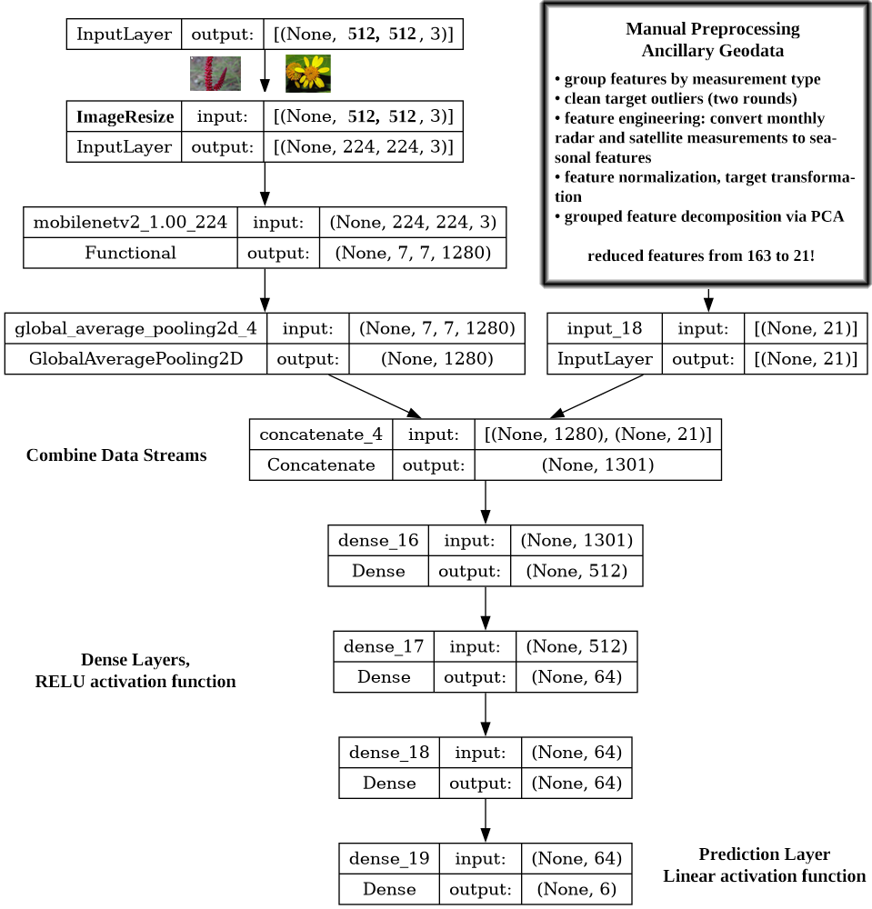

# PlantTraits2024 ([Kaggle](https://www.kaggle.com/competitions/planttraits2024))

**Predict 6 plant traits from plant images and ancillary geodata in an effort to measure ecoysystem health**

## Contents

 - [Submissions](#Submissions)
 - [Project Overview](#Project-Overview)
 - [Data]()
   - [images](#Images)
   - [geodata](#Geodata)
   - [plant trait targets](#Plant-trait-targets)
 - [Preprocessing](#Preprocessing)
 - [Modeling](#Modeling)
 - [Outcomes](#Outcomes)
 - [Environment Notes](#Kaggle-Notebook-Environment)

### Submissions

 1. [Project Proposal](./proposal.pdf) *24.4.1*
 2. [Data Wrangling, EDA](./26.2.1%20Data%20Wrangling%20and%20EDA.ipynb) *26.2.1*
 3. [Preprocessing, Modeling](./28.1.1%20Preprocessing%20and%20Modeling.ipynb) *28.1.1*
 4. Documentation 
    - [report](./report.pdf) *28.1.2*
	- [slides](./slides.pdf) *28.1.3*
	- [model metrics](./model_metrics.csv)
	

### Project Overview

**[Kaggle Competition](https://www.kaggle.com/competitions/planttraits2024/overview)** | 
**[FGVC Workshop](https://sites.google.com/view/fgvc11/)** | 
**[Related Work](https://www.nature.com/articles/s41598-021-95616-0)**

*competition notes*
> The primary objective of this competition is to employ deep learning-based regression models, such as Convolutional Neural Networks (CNNs) like ConvNext or Transformers, to predict plant traits from photographs. These plant traits, although available for each image, may not yield exceptionally high accuracies due to the inherent heterogeneity of citizen science data. The various plant traits describe chemical tissue properties that are loosely related to the visible appearance of plants in images. Despite the anticipated moderate accuracies, the overarching goal is to explore the potential of this approach and gain insights into global changes affecting ecosystems. Your contribution to uncovering the wealth of data and the distribution of plant traits worldwide is invaluable.

*project notes* [proposal](./proposal.pdf)
 - use training dataset only
 - establish suitable evaluation metric for multi-output regression
 - final model should consider complexity and training time in addition to accuracy
   - Convolutional Neural Networks were focus of my exploration
 
### Data

The key data challenge for this project is data cleaning. Not all plant trait targets are reasonable values, and should be removed before training models.

**Source Summary** [project data descriptions](https://www.kaggle.com/competitions/planttraits2024/data)
| Description | Notes | Link |
|-------------|-------|------|
| Plant images | 512x512 RBG images, collected from iNaturalist. Citizen science! | [iNaturalist](https://www.inaturalist.org/) |
| Ancillary Geodata | 163 features in four broad measurement categories (Climate, Soil, Satellite, RADAR) | globally available raster data, links below | 
| Plant trait targets | 6 chemical tissue properties, loosely related to plant's appearance. Presented as specie's mean. | [TRY database](https://www.try-db.org/TryWeb/Home.php) |

 - ~55k training samples reduced to ~54k after target outlier cleaning
 - 6:2:2 split for training, validation, and hold-out testing

#### Images

 - 512x512x3 photographs from "citizen scientists"
   - downsized to default image size for transferred CNN architectures
   - "augmented" within model layers
 - variety of styles, compositions
 - used to determine cutoffs for plant trait outlier cleaning
 

Plant Height threshold example `X18_mean`

 
 

 

#### Geodata

Data given for each sample, based on photograph's locatation. Seasonal features engineered to replace monthly means for Satellite and RADAR measurements. 
Each feature group was independently decomposed via PCA to achieve 21 total PCA components from 163 ingoing features. Features were z-score normalized prior to PCA decomposition.

 - **[WORLDCLIM](https://www.worldclim.org/data/bioclim.html)** describes climate and precipitation, *6 features*
 - **SOIL** describes soil chemical/composition measurements at various depths, *61 features*
   - [reference 1](https://soilmapper.org/preface.html), [reference 2](https://www.terracottem.com/en/news/soil-and-its-acronyms-text)
 - **[Satellite](https://modis.gsfc.nasa.gov/data/dataprod/Rrs.php)** describes sun exposure, measured at five different frequency bands, *60 features*
 - **RADAR** describes atmospheric water content and plant biomass, measured at 3 different frequency bands, *36 features*
   - [reference](https://lotusarise.com/satellite-frequency-bands-upsc/)
 
##### Feature Engineering

I referenced the seasonality definitions for the **WORLDCLIM** features to engineer features for the satellite and radar measurements. Each measurement's 12 monthly means were reduced to:
 - annual mean = sum of months / months
 - annual delta = max masurement - min measurement
 - seasonality = monthly standard deviation / annual mean

These engineered features were used for the subsequent PCA decomposition.

#### Plant trait targets

The six targets for regression were:

1. Stem specific density `X4_mean`
2. Leaf area per leaf mass `X11_mean`
3. Plant height `X18_mean`
4. Plant seed dry mass `X26_mean`
5. Leaf nitrogen per area `X50_mean`
6. Leaf area `X3112_mean`

Distributions were visually assessed for outliers, which were then checked with [plant images](./graphs/target%20outliers/images), as exemplified above. 
The following shows histograms for each plant trait before cleaning, after cleaning, and then after box-cox Power Transformation.

### Preprocessing Summary

1. Remove samples with negative targets. Outlier detection and cleaning of plant trait targets.
Remove based on visual assessment upper-bound cutoffs, then based on deviance.
(~2% samples removed)
2. Engineer seasonal features for radar and satellite measurements, drop originals.
3. Split training and hold-out testing sets. Feature normalization, decomposition, and target
transformation will only be fit to the training set, then applied to both sets.
4. Normalize features to unit variance (set mean to 0, standard deviation to 1).
5. Perform feature-group specific PCA decomposition.
6. Power-transform plant trait targets.
7. Split training and validation sets for model training.

Traits were inverse-transformed prior to residual analysis. The box plots below show the trait distributions for the training, validation, and hold-out testing sets.

*Power Transformed*

*Raw Values*

### Modeling

The method outlined in the reference [paper](https://www.nature.com/articles/s41598-021-95616-0)) was loosely followed for modeling efforts. 
Given the computational cost and training time for the large dataset, experiments were focused on broad model parameters.
This project can serve as a template for future work and model performance should be easily improved. Some findings are listed below:

 - *transformer models showed promise for other Kaggle competitors but were not used for this project. I focused on CNNs*
   - [first place solution](https://www.kaggle.com/competitions/planttraits2024/discussion/510393)
 - Mean Absolute Error suitable metric for transformed targets. LogCosh best for raw targets, where some traits span a much greater range of magnitudes.
   - LogCosh used as Loss function.
 - utilizing [existing architectures](https://keras.io/api/applications/) much better than a simple CNN
   - experimented with most models available through Keras, linked above
 - MobileNetV2 and InceptionResNetV2 gave best performance
   - MobileNetV2 had much faster training and lower complexity and default image resolution allowed larger batch sizes for training
   - reference paper used InceptionResNetV2
 - fully retraining transferred architecture weights more accurate than using ImageNet weights. Same training duration.
 - dynamic resizing layer better than resizing during dataset generation
 - image augmentation improved performance
 - predicting all traits together (Multi-Output regression) seems best for this model, *some geodata only models were better with sequential trait prediction*
 - dynamic learning rate schedule was helpful with [Adam amsgrad optimizer](https://arxiv.org/abs/1904.09237)
   - room for improvement

The schematic below shows the final model scheme, which utilized [MobileNetV2](https://arxiv.org/pdf/1801.04381) for image feature extraction.

The final model contains two "data streams". One for the plant images, which contains a learnable resizing layer, image augmentation layers, amd featire extraction via MobileNetV2. 
The other simply takes the processed geodata as an input. These features are concatenated and then fed into fully connected dense layers for plant trait prediction.

Model Training Histories

*raw metrics are presented in titles, graphed metrics are with transformed targets*

 

 
 

 

### Outcomes

The model using MobileNet's architecture was chosen for the final model, despite having the second best accuracy. 
Training iterations for future work should be faster with this model, and it can be more broadly applied. 
For example, a simple server for plant traits prediction will require much less computing power to use this model.

From the [report](./report.pdf):
> Data cleaning and feature processing methodologies were established in this project, and they
ultimately contributed to a CNN based model with reasonable accuracy in predicting six plant traits. As
discussed in the Kaggle competition, this is an important step to utilizing existing “data treasures” to
study and understand our ecosystem in real time. Plants are important biomarkers for various
ecosystems, meaning they be used as a proxy to measure broader environmental health and conditions.

**Hold Out Test Scores** *included CatBoost for geodata only model reference*

| Metric   | MobileNet | IncResNet | CatBoost |
| -------- | --------- | --------- | -------- |
| MAE      |    212    | 192       | 263      |
| LogCosh  |    212    | 192       | 263      | 
| Time     | 45 mins   | 124 mins  | 40s      |

Residuals were anlayzed for each trait, and specific predictions were assessed with the associated images.

Error seems to be randomly distributed for most traits, but `X18` **Plant Height** may show some patterns. 
Predictions may also be less accurate for higher values of certain traits, could this indicate better data cleaning practices are needed?

The best and worst predictions for **Leaf Area** `X3112_mean` are shown with associated plant images, below.

 
 - over predictions on top row, under-predictions on bottom row

 

### Kaggle Notebook Environment

*my local setup requires DirectML for GPU + Tensorflow (v 1.15), so most GPU accelerated training occured within Kaggle notebooks. see environment description in file below.*

[Kaggle `pip freeze`](./kaggle_notebook_environment.txt)

